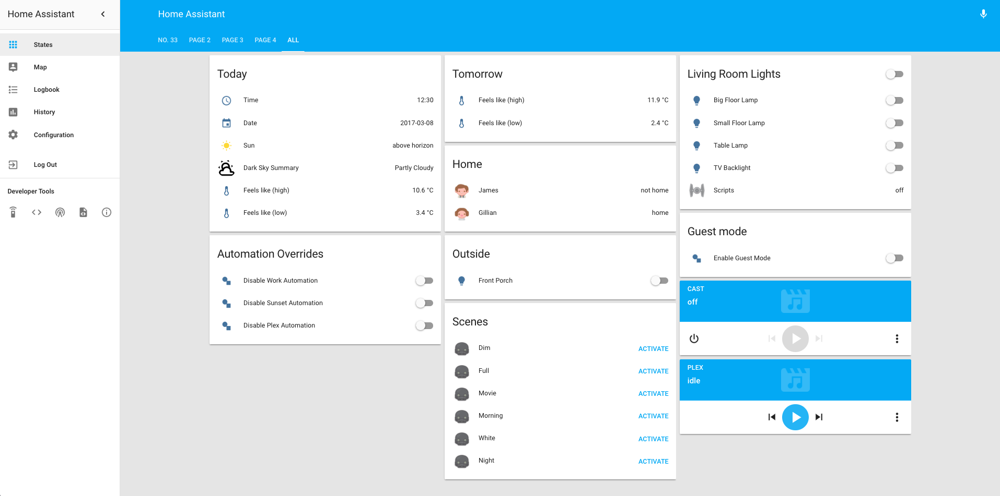

# Home Assistant Configuration

## Screenshot

## Setup
- Synology DS415+ *(running synology docker)*
- [Home Assistant](https://home-assistant.io/)
- [Homebridge](https://hub.docker.com/r/marcoraddatz/homebridge/)
- homebridge-homeassistant

## Things
- Plex Media Server *(currently running via synology docker)*
- Philips Hue
- Sonos
- [Tado Smart Thermostat](https://www.tado.com/gb/) *(currently only integrated with home-assistant as device tracker)*
- Nvidia Shield TV *(also runs plex media server but not yet good enough for main server due to smb bug in software)*

## Automations
Plex
- Activate native hue scene (movie) when movie playing in plex
- Activate native hue scene (full) when movie stopped or paused in plex
- Activate native hue scene (dim) when tvshow playing in plex
- Activate native hue scene (full) when tvshow stopped or paused in plex
- Stop sonos speakers playing when plex starts playing movie or tvshow

Lights
- Turn lights on around sunset (inside & out)
- Turn inside lights off at bedtime
- Turn outside lights off in the morning

Notifications
- Send pushover notification if home-assistant restarts
- Send pushover notification if home-assistant has an update available

Various
- Guest mode - turns off certain automations if we have guests over (i.e. we *might* have to stay up later than 22:15!)
