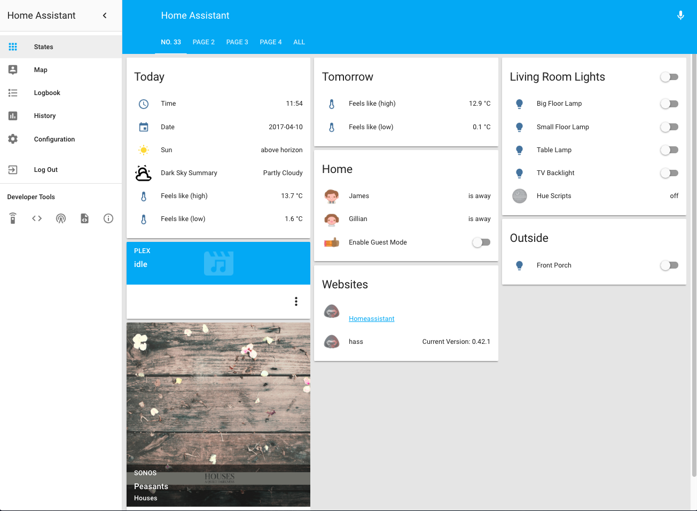

# Home Assistant Configuration

## Screenshot

## Setup
- Synology DS415+ *(running synology docker)*
- [Home Assistant](https://home-assistant.io/)

## Things
- Plex Media Server *(currently running via nvidia shield)*
- Philips Hue (lights, tap & motion sensor)
- Sonos
- [Tado Smart Thermostat](https://www.tado.com/gb/)
- Nvidia Shield TV *(plex client, cast, kodi)*

## Presence
- Ping, Bluetooth & Tado device tracking
- Bayesian Sensor provides probability based logic which seems to >
  make presence detection more accurate 

## Automations
Plex
- Activate native hue scene (movie) when movie playing in plex
- Activate native hue scene (full) when movie stopped or paused in plex
- Activate native hue scene (dim) when tvshow playing in plex
- Activate native hue scene (full) when tvshow stopped or paused in plex
- Pause sonos speakers when plex/cast/kodi starts playing movie or tvshow

Monzo Bank
- Notify if my balance is getting low

Lights
- Turn lights on around sunset (inside & out)
- Turn inside lights off at bedtime
- Turn outside lights off in the morning

Notifications
- Send pushover notification if home-assistant restarts
- Send pushover notification if home-assistant has an update available

Telegram Bot
- Interact with home assistant from anywhere with telegram bot

Various
- Guest mode - turns off certain automations if we have guests over (i.e. we *might* have to stay up later than 22:15!)
